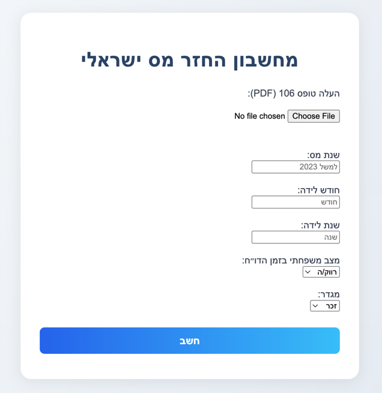
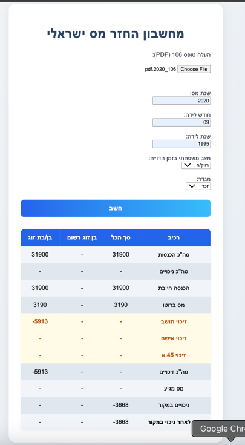

# Israeli Tax Refund Calculator

A simple tool to estimate income tax refunds in Israel based on annual earnings and eligibility criteria.

---

## Features
- Upload your annual "טופס 106" (Form 106) in PDF format
- Enter your birth month/year, family status, and gender
- Instantly calculate your estimated tax refund or liability
- Supports calculations for both individuals and couples
- Clear, easy-to-read results table

---

## How It Works

1. **Upload Form 106**: Select your annual tax form (PDF) for analysis.
2. **Enter Details**: Fill in your tax year, birth month/year, family status, and gender.
3. **Calculate**: Click the "חשב" button to process your data and view your results.

---

## Screenshots

### 1. Input Form


- Upload your Form 106 (PDF)
- Enter tax year, birth month/year, family status, and gender
- Click "חשב" to calculate

### 2. Results Table


- View a detailed breakdown of your tax components
- See credits, deductions, and final tax due
- Negative values (e.g., credits) are highlighted

---

## Installation

1. Clone the repository:
   ```bash
   git clone https://github.com/yourusername/israeli-tax-refund-calculator.git
   cd israeli-tax-refund-calculator
   ```
2. Install dependencies:
   ```bash
   pip install -r requirements.txt
   ```
3. Run the application:
   ```bash
   python main.py
   ```

---

## Usage

- Open your browser and go to `http://localhost:8000`
- Follow the instructions on the page
- Results are displayed instantly after submitting your details

---

## Project Structure

- `main.py` - Application entry point
- `templates/index.html` - Web interface
- `tax_authority_api/` - Tax calculation logic and models
- `rest/endpoints.py` - API endpoints
- `resources/1.png`, `resources/2.png` - Screenshots for documentation

---

## Contributing

Pull requests and suggestions are welcome! For major changes, please open an issue first to discuss what you would like to change.

---

## License

This project is licensed under the MIT License.
